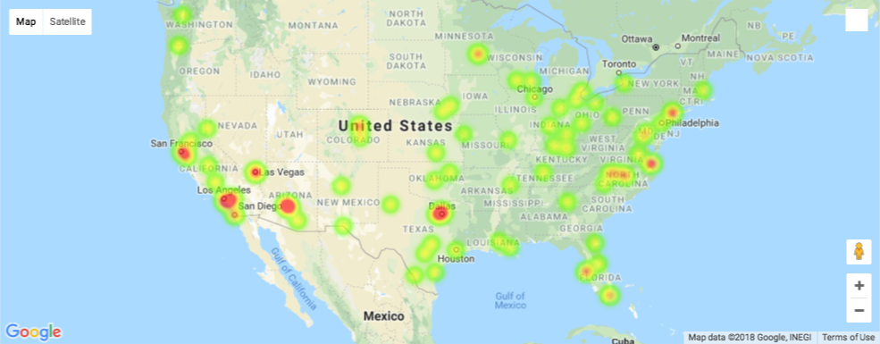
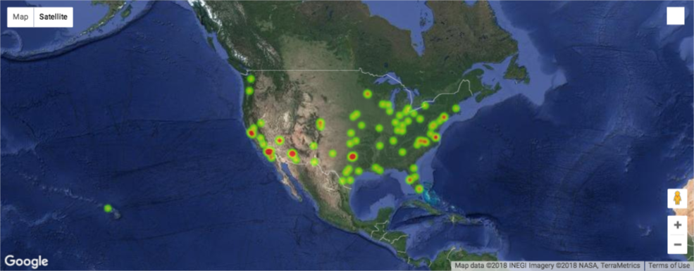
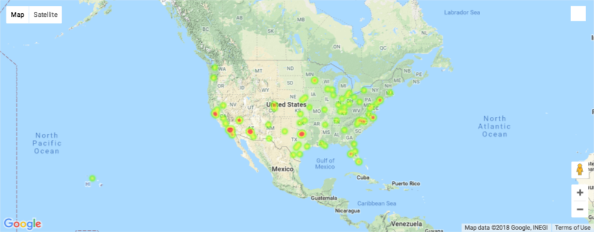

# Hot Airport Reviews

In this project I will create a heatmap for ratings of airports.

## Instructions

* navigate to your [Google Developer's Console](https://console.developers.google.com/) and enable the __Maps JavaScript API__.

* Install `gmaps`

* If it's not already running, start your virtual environment.

  * On Windows: `activate PythonData`

  * On Mac: `source activate PythonData`

* Then, from the command line run: `conda install -c conda-forge gmaps`

  * Use the latitude and longitude to place the airport

  * Use the rating to weight the heatmap.

  * handle `NaN` values and data type in your Airport Ratings.

  * Refer to the [gmaps documentation](http://jupyter-gmaps.readthedocs.io/en/latest/tutorial.html#heatmaps) for instructions on how to implement heatmaps.

  

* Explore the [documentation](http://jupyter-gmaps.readthedocs.io/en/latest/tutorial.html#base-maps) to plot the map as two more types of maps.

  

  
